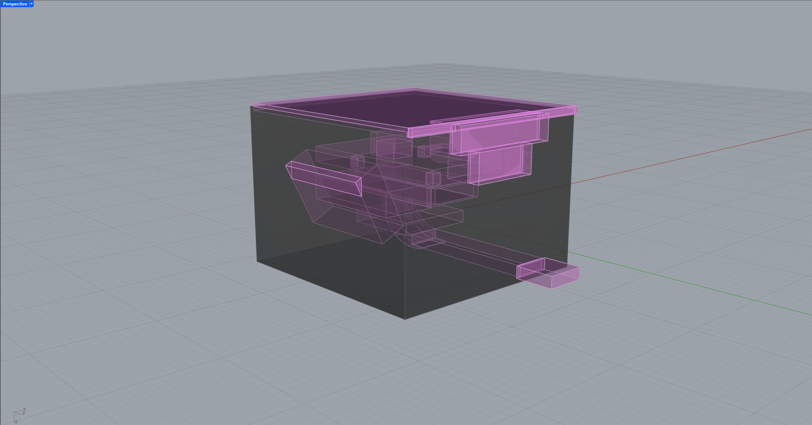
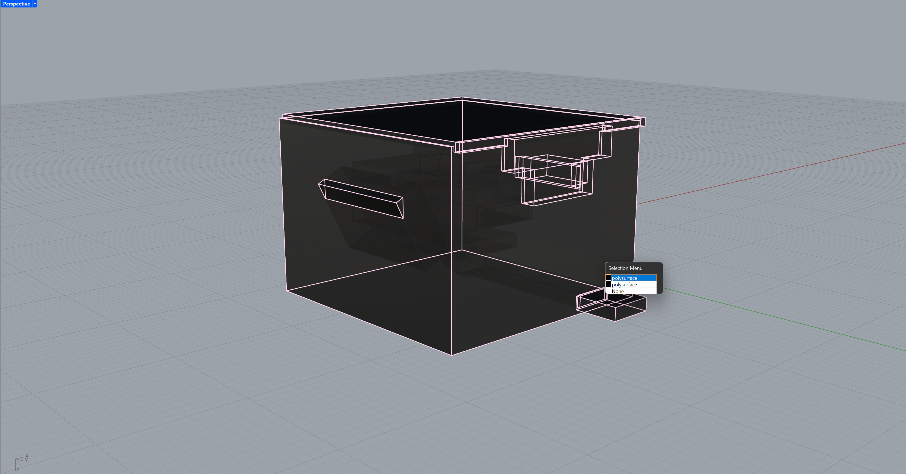
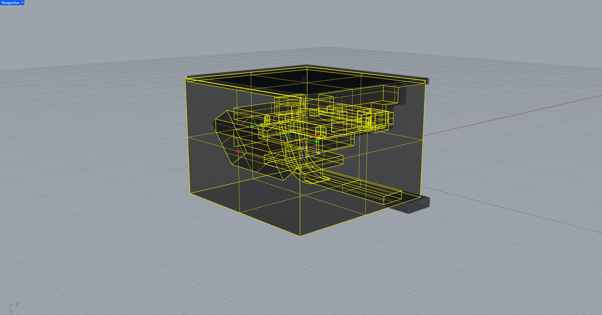
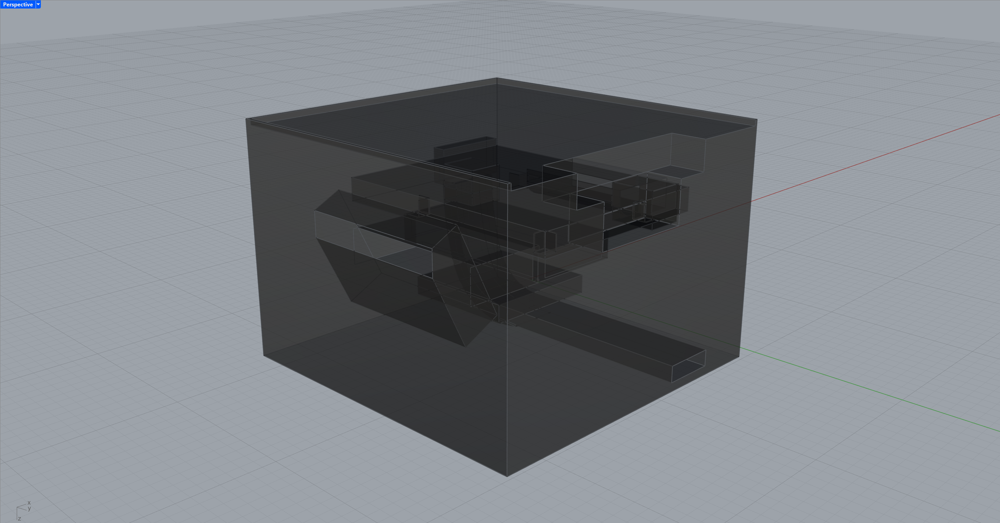
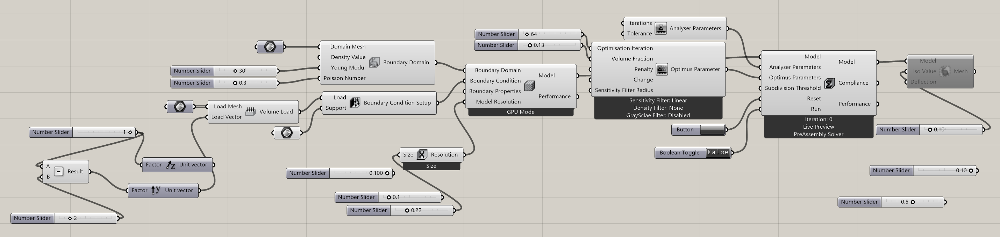

# Rhino + Grasshopper tOpos Workflow (Domain Cuttings + GPU Solve)

This repo documents a practical workflow for using **tOpos** in Rhino/Grasshopper when you need **“no-grow” zones** inside your optimization domain.

tOpos lets you define a **domain boundary** (where topology is allowed to exist), but it doesn’t natively let you “paint” forbidden voids inside that domain.  
So the core trick here is: **build the domain as a solid with internal voids** (I call them **domain cuttings**) before you ever feed it into tOpos.

---

## Repo contents

- `251222 tOpos.gha`  
  Grasshopper definition with my working settings (GPU-mode, solver params, meshing outputs).
- `Images/`  
  Step images referenced below:
  - `Step-1.png` — domain boundary (gray) + domain cuttings (pink)
  - `Step-2.png` — after region extraction (positive vs negative regions)
  - `Step-3.png` — after deleting the “positive”
  - `Step-4.png` — after isolating the final domain boundary

---

## Requirements

- Rhino 8 + Grasshopper
- tOpos_v1.0 plugin ([Official tOpos Plugin](https://www.food4rhino.com/en/app/topos))
- NVIDIA GPU strongly recommended (tOpos is GPU-accelerated; GPU + VRAM matters a lot)  
- Windows tends to be the most reliable environment for this toolchain (anecdotally, and based on community discussion). :contentReference[oaicite:1]{index=1}

---

## Part A — Rhino: creating “domain cuttings” (no-grow voids)

### Concept
- **Gray** = *Domain Boundary* (the volume where tOpos is allowed to “grow” material)
- **Pink** = *Domain Cuttings* (volumes you want to carve out so tOpos cannot occupy them)



### The exact command sequence I use

```txt
_SelAll
NonmanifoldMerge
_SelAll
CreateRegions
_Delete  (delete the “positive”)
Invert
Hide
```

### Workflow Definition

#### 1) `_SelAll`
Select the domain boundary + all cutting solids (and any helper curves).

#### 2) `NonmanifoldMerge`
This step forces Rhino to treat touching/intersecting polysurfaces as a single connected “topological soup.”

- The goal is **not** a perfect CAD boolean.
- The goal is to produce geometry that `CreateRegions` can reliably interpret as partitioned space.

Think of it as “prep for region extraction.”

#### 3) `_SelAll` again
After merges, Rhino may change what’s active/selected. Selecting again ensures you feed the full merged set into the next step.

#### 4) `CreateRegions`
This is the key: it tries to detect enclosed **closed volumes** (regions) from the merged topology.

When you have a big domain + internal cutter volumes, `CreateRegions` usually outputs two conceptual results:

1) **Positive region** (unwanted): “the outside / the everything region”  
2) **Negative region** (wanted): the domain boundary **minus** the cutters (your voids get baked in)



#### 5) `_Delete` the “positive”
Delete the region that represents the wrong side / the “everything” region.

This leaves the region you actually want: **the domain boundary with the cuttings removed**.



#### 6) `Invert` + `Hide` (cleanup)
At this point, you usually still have leftover cutter objects sitting around.

- Select the good domain boundary.
- Run `Invert` to select everything else.
- Run `Hide` to hide leftovers.

End result: a single clean domain boundary polysurface with voids already carved out.



---

## Part B — Grasshopper tOpos Workflow



This section describes the intent behind the components in `251222 tOpos.gha`.

### 1) Boundary Domain (BREP)
- **Boundary Domain (BREP)**: plug in the Rhino domain boundary you just created (with cuttings removed).
- **Young’s Modulus**: `30`
- **Poisson’s Ratio**: `0.3`

I’m not using these as “real engineering” values here — they’re simply settings that behave well for my form-finding. If you need structural accuracy, use real material values + validate externally.

### 2) Volume Load + Load Vector
- **Volume Load**: the object(s)/region(s) where forces are applied.
- **Load Vector**: I used a **-Y unit vector** (0, -1, 0).

Tip: depending on your model orientation, a **+Z** vector can make more sense. The main point is: load direction strongly shapes the growth direction.

### 3) Support (BREP)
This is where “growth starts from” / what’s fixed.

Practical pattern I’ve noticed:
- If the support volume slightly overlaps *outside* the domain boundary (instead of being perfectly contained),
  the solver often produces more stable “roots” and fewer weird skinny attachments.

### 4) Model + GPU Mode + Resolution
All of the above inputs feed into the `Model` component.

**Important: enable GPU Mode.**

#### Resolution (this matters most)
Resolution is the biggest lever for:
- VRAM usage
- compute time
- quality / detail

My working rule-of-thumb:
- For ~5×5×5 inch domains: start around ~0.75 and go down if you have VRAM headroom.
- For my smaller ~3×3×3 inch domain: **0.22** is my sweet spot on a **3070 Ti (8GB)**.

If you see:
- crashes / out-of-memory → your resolution is too fine
- the app “hangs” for a long time → resolution is likely too fine (or the domain is too complex)

### 5) Optimus Solver
The `Model` feeds into the `Optimus Solver`.

#### Optimus Iterations
This is the maximum number of solve steps.
I usually use powers of two:
- 32 / 64 / 128 / 256

In practice, the system will stop early when it converges and can’t improve further.

#### Volume Fraction
Volume Fraction controls how much material remains compared to the full domain volume:
- `1.0` = keep 100% (basically no thinning)
- `0.13` = keep ~13% (much thinner / more skeletal)

Volume Fraction is also a printability lever:
- too low → thin features disappear or become fragile
- higher → thicker members, better for FDM

#### Solver UI / modes
Inside the solver component, right click:
- Turn on **Live Preview**
- Use **PreAssembly Solver** (this is the only one that has consistently worked for me in Rhino 8)
- Keep a **Boolean Toggle** to start/stop (Double Click to begin training)

---

## Part C — Viewing & Meshing (Voxel vs ISO)

### Voxel Mesh (for viewing)
Use voxel output when you want to watch the “growth” process.
It’s usually far faster and more stable for live preview.

### ISO Mesh (for final surface / export)
ISO meshes are high quality topology meshes, but they are heavier and can tank performance. So only attach this in when you're ready to bake.

**Workflow tip:** keep the ISO mesh output **disconnected** until the optimization has finished (or until you’re ready to bake/export).

---

## Troubleshooting (quick)

### Solver doesn’t run / nothing updates
- Confirm GPU Mode is enabled on the Model component
- Confirm your domain boundary is a valid closed BREP
- Disconnect ISO mesh outputs while solving
- Try a coarser resolution

### VRAM maxes out / Rhino hangs
- Resolution too fine → increase the resolution value (coarser)
- Simplify the domain boundary geometry
- Avoid heavy viewport previews

### Result is too thin to print (FDM)
- Increase Volume Fraction
- Lower the iso threshold (keep more field)
- Ensure member thickness is above your printer’s minimum feature size

### “Broken mesh”: ISO Threshold Values
In most iso-surface workflows, the threshold / iso value controls what parts of the density field become “solid.”

Typical behavior:
- If the iso threshold is too aggressive, thin connections vanish → you get disconnected islands or holes.
- If the threshold is less aggressive, you keep more of the field → thicker, more connected surfaces.

So yes: it’s very plausible that one threshold value gave you broken meshes because it removed too much of the field / made members too thin.

My practical tuning order (for printable results):
1) Increase **Volume Fraction** first (thickness)
2) Adjust the **ISO threshold** until you stop seeing islands / broken bridges
3) Only then refine **Resolution** (if you have VRAM headroom)
4) Do mesh cleanup last (reduce / weld / remesh, depending on your pipeline)

In my case, **~0.25** was the sweet spot between “too thin and broken” and “too blobby / heavy.”

---

## Notes / disclaimer
This workflow is focused on producing controllable forms for design + fabrication.  
It is not a guarantee of structural performance. If your output is load-bearing or safety-critical, validate in proper FEA and/or consult an engineer.

---

## Changelog
- 2025-12-25: Initial repo workflow write-up + screenshots + `251222 tOpos.gha`